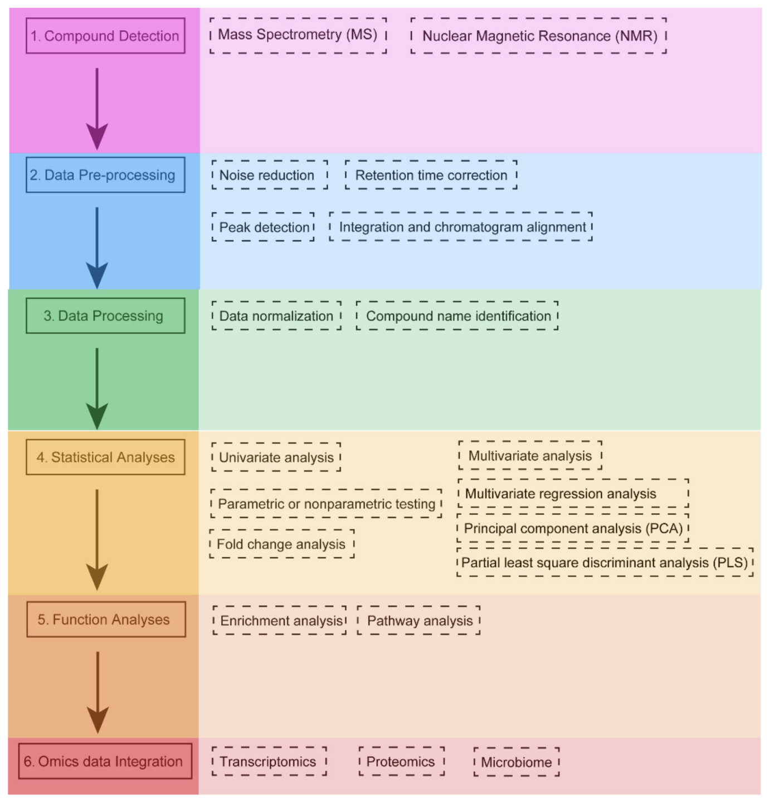

# Metabolomics_Data_Analysis
This repo covers my studies  and work about metabolomics data analysis

Metabolomics is the comprehensive study of the metabolome, which refers to the complete set of small-molecule metabolites (such as metabolic intermediates, hormones, and other signaling molecules) found within a biological sample. This field is a subset of systems biology and is analogous to genomics, transcriptomics, and proteomics, which study the genome, transcriptome, and proteome, respectively.

The terms "untargeted" and "targeted" in the context of metabolomics refer to different analytical approaches and objectives when studying metabolites. Untargeted metabolomics aims to capture as many metabolites as possible in a sample without a pre-defined list. The goal is often exploratory, aiming to discover new or unexpected metabolites or metabolic changes. In contrast, targeted metabolomics focuses on the accurate measurement of a specific set of known metabolites. The choice between these approaches depends on the research question, available resources, and the desired outcomes.

### **Untargeted Metabolomics (also known as Global or Discovery Metabolomics)**:

1. **Objective**: 
   - To capture as many metabolites as possible in a sample without a pre-defined list.
   - The goal is often exploratory, aiming to discover new or unexpected metabolites or metabolic changes.

2. **Coverage**:
   - Broad and non-specific. It tries to detect thousands of metabolites in a sample, regardless of their identity.

3. **Data Complexity**:
   - Generates large and complex datasets because of the wide range of metabolites detected.
   - Requires extensive data processing, including noise filtering, peak identification, and alignment.

4. **Quantification**:
   - Typically provides relative quantification, comparing the levels of metabolites across different samples or conditions.

5. **Applications**:
   - Biomarker discovery, where unknown metabolites might be indicators of a disease or condition.
   - Understanding global metabolic changes in response to stimuli or perturbations.

6. **Challenges**:
   - Metabolite identification can be challenging due to the vast number of detected features.
   - Requires comprehensive metabolite databases and often additional validation steps.

### **Targeted Metabolomics**:

1. **Objective**:
   - To specifically measure a predefined set of metabolites of interest.
   - The goal is often hypothesis-driven, focusing on known metabolic pathways or specific classes of metabolites.

2. **Coverage**:
   - Narrow and specific. Only the metabolites of interest (often a few dozen to a few hundred) are targeted and quantified.

3. **Data Complexity**:
   - Generates simpler datasets since only specific metabolites are targeted.
   - Data processing is more straightforward, focusing on the quantification of the predefined metabolites.

4. **Quantification**:
   - Provides absolute quantification, determining the exact concentration of each targeted metabolite in the sample.
   - Often uses internal standards for each metabolite to achieve high accuracy and precision.

5. **Applications**:
   - Validating and confirming findings from untargeted studies.
   - Monitoring specific metabolic pathways or processes.
   - Clinical diagnostics, where specific metabolites need to be accurately measured.

6. **Challenges**:
   - The range of metabolites is limited to the predefined list, so unexpected or unknown metabolites are missed.
   - Requires the development of specific analytical methods for each set of targeted metabolites.

In summary, while untargeted metabolomics aims for a broad overview and discovery of metabolic changes, targeted metabolomics focuses on the accurate measurement of a specific set of known metabolites. The choice between these approaches depends on the research question, available resources, and the desired outcomes.

## A brief overview of metabolomics data

1. **Types of Metabolites**: Metabolites can be broadly categorized into primary and secondary metabolites. Primary metabolites are directly involved in growth, development, and reproduction, while secondary metabolites are often involved in ecological interactions, such as defense against herbivores or pathogens.

2. **Techniques for Data Acquisition**:
   - **Mass Spectrometry (MS)**: This is one of the most commonly used techniques in metabolomics. It can be used to identify and quantify metabolites in a sample.
   - **Nuclear Magnetic Resonance (NMR) Spectroscopy**: Another common technique, NMR provides information about the structure and quantity of metabolites.
   - **Chromatography**: Techniques like gas chromatography (GC) and liquid chromatography (LC) are used to separate complex mixtures of metabolites before they are analyzed by MS or NMR.

3. **Data Analysis**:
   - **Preprocessing**: This step involves noise reduction, baseline correction, alignment, and normalization of the raw data.
   - **Identification of Metabolites**: Using databases and spectral libraries, the detected signals are matched to known metabolites.
   - **Quantification**: The concentration of each metabolite is determined.
   - **Statistical Analysis**: Techniques like principal component analysis (PCA) or partial least squares-discriminant analysis (PLS-DA) are used to identify patterns and differences between samples.
   - **Pathway Analysis**: This step involves mapping the identified and quantified metabolites onto known metabolic pathways to understand the biological context.

4. **Applications**:
   - **Biomarker Discovery**: Identifying metabolites that can act as indicators for diseases or other physiological states.
   - **Drug Development**: Understanding the metabolic response to drugs and identifying potential side effects.
   - **Functional Genomics**: Linking genes to their metabolic functions.
   - **Nutrition and Agriculture**: Studying the effects of diet on metabolism or improving crop quality and resistance.

5. **Challenges**:
   - **Complexity**: The metabolome is highly dynamic and can vary based on factors like age, diet, environment, and health status.
   - **Sensitivity**: Detecting low-abundance metabolites can be challenging.
   - **Annotation**: Many detected metabolites remain unidentified due to the lack of comprehensive reference databases.

6. **Databases and Tools**: There are several databases and software tools available for metabolomics data analysis. Examples include METLIN, HMDB (Human Metabolome Database), and MassBank. Software tools like XCMS, MetaboAnalyst, and MZmine are commonly used for data processing and analysis.

In summary, metabolomics offers a snapshot of the physiological state of an organism by analyzing its metabolites. The data generated can provide insights into various biological processes, disease states, and responses to environmental changes.

## Databases 

There are several databases that have been developed to store, organize, and provide access to metabolomics data. 

**A list of some of the most widely used metabolomics databases:**

1. **HMDB (Human Metabolome Database)**: This is a comprehensive resource for human metabolites. It provides detailed information about metabolites, including their structures, biochemistry, and biological roles.The link for the website is as follows: [https://hmdb.ca/](https://hmdb.ca/)

2. **METLIN**: A metabolite and tandem mass spectrometry database, METLIN provides information on thousands of metabolites and supports identification efforts in metabolomics. Website: https://metlin.scripps.edu/ 

3. **MassBank**: This is a public repository for mass spectra, which can be used for the identification of metabolites based on their spectral data. Website: https://massbank.eu/MassBank/

4. **LipidMaps**: As the name suggests, this database focuses on lipids. It provides structures, nomenclature, and other relevant information about lipids. Website: https://www.lipidmaps.org/

5. **GNPS (Global Natural Products Social Molecular Networking)**: This is a platform for collaborative molecular discovery and provides a public data repository for mass spectrometry data. Website: https://gnps.ucsd.edu/ProteoSAFe/static/gnps-splash.jsp 

6. **MetaboLights**: Hosted by the European Bioinformatics Institute (EBI), MetaboLights is a database for metabolomics experiments and derived information. It's a comprehensive resource that includes experimental data, metadata, and analytical results. Website: https://www.ebi.ac.uk/metabolights/

7. **MoNA (MassBank of North America)**: This is a free and open repository of mass spectral data, which is particularly useful for natural products research. Website: https://mona.fiehnlab.ucdavis.edu/

8. **BioMagResBank (BMRB)**: This is a repository for data from NMR spectroscopy on proteins, peptides, nucleic acids, and other biomolecules. While not exclusively for metabolomics, it's a valuable resource for NMR-based metabolomics studies. Website: https://bmrb.io/

9. **KNApSAcK**: A comprehensive species-metabolite relationship database, useful for researchers studying plant metabolomics. website: http://www.knapsackfamily.com/KNApSAcK/

10. **Metabolomics Workbench**: This platform provides a suite of tools and databases to facilitate metabolomics research. It includes data from various metabolomics studies, reference compounds, and more. Website: https://www.metabolomicsworkbench.org/

11. **Golm Metabolome Database (GMD)**: This database provides mass spectra, metabolite profiles, and related information, primarily for plant metabolomics. Website: http://gmd.mpimp-golm.mpg.de/

12. **MMCD (Madison Metabolomics Consortium Database)**: It contains data on metabolites, including their NMR and MS spectra. Website: http://english.qibebt.cas.cn/ic/ji/medison/201406/t20140605_122189.html

When using these databases, it's essential to be aware of the type of data they contain (e.g., spectral data, metabolite structures, experimental data) and the organisms or biological contexts they cover. This will help in selecting the most appropriate database for a specific research question or analysis.

## Metabolomics Data

Metabolomics data can be quite complex due to the vast number of metabolites present in biological samples and the various techniques used to detect them. 

**A general overview of what metabolomics data might look like:**

1. **Raw Data**:
   - **Mass Spectrometry (MS)**: Raw data from MS experiments typically consist of mass-to-charge ratios (m/z) plotted against intensity. In tandem MS (MS/MS), you'll also see fragmentation patterns of selected ions.
   - **Nuclear Magnetic Resonance (NMR) Spectroscopy**: Raw NMR data are presented as spectra where chemical shifts (usually in ppm) are plotted against intensity. Peaks in the spectra correspond to specific nuclei in the metabolites.

2. **Processed Data**:
   - **Peak Lists**: After processing raw data, you'll often have a list of detected peaks with their corresponding m/z values (for MS) or chemical shifts (for NMR), and their intensities.
   - **Metabolite Identification**: Peaks are matched to known metabolites using databases. This results in a list of identified metabolites and their quantities in the sample.
   - **Matrix Format**: For multivariate analysis, data are often organized into a matrix where rows represent samples, columns represent detected metabolites, and the cell values represent the quantity or intensity of each metabolite in each sample.

3. **Metadata**:
   - Information about the samples, such as the source (e.g., human plasma, plant tissue), conditions (e.g., disease state, treatment), and any other relevant experimental details.

4. **Annotation**:
   - Once metabolites are identified, they can be annotated with additional information, such as their pathways, biological roles, and chemical properties.

5. **Visualization**:
   - **Heatmaps**: Used to visualize the relative levels of metabolites across multiple samples.
   - **Chromatograms (for MS data)**: Plots showing the intensity of detected ions as a function of retention time.
   - **Spectra (for NMR data)**: Plots showing the intensity of detected signals as a function of chemical shift.
   - **Metabolic Pathway Maps**: Visual representations of metabolic pathways with highlighted metabolites that have been detected or show significant changes.

6. **Statistical Outputs**:
   - Results from statistical analyses, such as p-values, fold changes, and scores from multivariate analyses (e.g., PCA or PLS-DA scores).

In practice, the appearance of metabolomics data will depend on the software and tools used for data acquisition, processing, and analysis. However, the above gives a general sense of the types of data and visualizations you might encounter in metabolomics research.

## Processing raw MS-based metabolomics data
Processing raw metabolomics data obtained from mass spectrometry (MS) is a crucial step to transform the complex datasets into a format suitable for downstream analysis and biological interpretation.

**A general workflow for processing raw MS-based metabolomics data:**

1. **Data Conversion**:
   - Convert vendor-specific raw data files into open formats like mzXML or mzML. Tools like ProteoWizard's MSConvert can be used for this purpose.

2. **Peak Detection**:
   - Identify peaks in the MS data. This involves distinguishing genuine metabolite signals from noise.
   - Each peak corresponds to an ionized metabolite, and its height or area represents its abundance.

3. **Baseline Correction**:
   - Remove the background signal to enhance the genuine peaks. This step helps in improving the accuracy of peak detection and quantification.

4. **Peak Alignment**:
   - When analyzing multiple samples, it's essential to ensure that the same metabolite is aligned across all samples. This step compensates for minor variations in retention times across different runs.
   - Tools like XCMS and MZmine are popular for peak detection and alignment.

5. **De-isotoping**:
   - MS data often contain isotopic peaks, which are signals from heavier isotopes of the elements in the metabolites (e.g., C-13 instead of the more common C-12). 
   - De-isotoping involves identifying and removing these redundant peaks to retain only the monoisotopic peak for each metabolite.

6. **Gap Filling**:
   - Sometimes, a metabolite might not be detected in a particular sample due to its low concentration. Gap filling involves estimating or imputing these missing values.

7. **Normalization**:
   - To account for variations in sample concentration or instrument sensitivity, data are normalized. Common methods include total ion current (TIC) normalization, probabilistic quotient normalization (PQN), or normalization to internal standards.

8. **Metabolite Identification**:
   - Match the detected m/z values and, if available, MS/MS fragmentation patterns to known metabolites in databases like METLIN, MassBank, or HMDB.
   - This step can be challenging due to the vast number of possible metabolites and isomers, and not all detected features will be confidently identified.

9. **Quantification**:
   - Determine the concentration or relative abundance of each identified metabolite. This can be done using the peak area or peak height.

10. **Quality Control**:
   - It's essential to include quality control (QC) samples in the experiment, which are analyzed throughout the run.
   - QC samples help in assessing the stability, reproducibility, and overall quality of the data. Any systematic drifts or anomalies can be detected and corrected.

11. **Batch Effect Correction** (if necessary):
   - If samples were run in multiple batches, there might be batch-specific variations. These need to be identified and corrected to ensure that the observed differences are due to the experimental conditions and not technical artifacts.

12. **Data Transformation and Scaling**:
   - Before statistical analysis, data might be log-transformed, auto-scaled (mean-centered and divided by the standard deviation), or Pareto-scaled (mean-centered and divided by the square root of the standard deviation).

Once these processing steps are completed, the data are ready for downstream statistical analysis, such as univariate or multivariate analysis, to identify significant metabolites or patterns related to the experimental conditions.

    

        
        <em>Workflow for metabolomics data analysis </em> [1]
    

### Peak Detection (Peak Picking)

Peak picking is a critical step in the analysis of mass spectrometry (MS) and nuclear magnetic resonance (NMR) data. It involves the identification and quantification of peaks, which represent specific analytes (like metabolites in metabolomics studies). Several approaches have been developed for peak picking, each with its advantages and challenges. 

**Some of the common approaches:**

1. **Threshold-Based**:
   - This is the simplest method where peaks are identified based on an intensity threshold. Any signal above this threshold is considered a peak.
   - The threshold can be set manually based on visual inspection or determined automatically using various algorithms.

2. **Derivative-Based**:
   - Peaks can be identified by looking at the first or second derivative of the intensity profile.
   - Zero-crossings in the first derivative or points where the second derivative changes sign can indicate peak positions.
   - This method can help distinguish real peaks from noise but may be sensitive to baseline variations.

3. **Wavelet Transform**:
   - Wavelet transform allows the decomposition of a signal into different frequency components.
   - This method can be particularly useful for noisy data or when peaks are closely spaced, making them hard to distinguish using simpler methods.
   - Tools like `CWT` (Continuous Wavelet Transform) can be used for peak detection in this approach.

4. **Model-Based**:
   - Peaks are modeled using predefined shapes, often Gaussian or Lorentzian.
   - The data is then fitted to these models, and peaks are identified based on the fit.
   - This approach can provide accurate peak shapes and positions but may be computationally intensive.

5. **Deconvolution**:
   - This method aims to separate overlapping peaks by deconvolving the observed spectrum.
   - It's particularly useful when multiple compounds produce peaks at similar m/z values, leading to overlapping signals.
   - Algorithms like the Maximum Entropy Method (MEM) can be used for deconvolution.

6. **Machine Learning**:
   - With the rise of machine learning, algorithms have been developed to identify peaks using trained models.
   - These models can be trained on labeled data to recognize and distinguish real peaks from noise or artifacts.
   - Deep learning, especially convolutional neural networks (CNNs), has shown promise in this area.

7. **Matched Filtering**:
   - This method involves convolving the data with a known peak shape (or a set of shapes).
   - The convolution result can highlight positions in the data that match the expected peak shape, aiding in peak detection.

8. **Data-Adaptive Methods**:
   - These methods adjust parameters based on the characteristics of the data.
   - For instance, local noise estimation can be used to set adaptive thresholds for peak picking in different regions of a spectrum.

When choosing a peak picking method, it's essential to consider the nature of the data (e.g., the level of noise, the expected number of peaks, peak shapes) and the specific requirements of the study. Often, a combination of methods or iterative approaches is employed to ensure accurate and comprehensive peak detection.
## Exploratory Data Analysis (EDA) for metabolomics data
Exploratory Data Analysis (EDA) is a crucial step in metabolomics research, as it allows researchers to understand the structure, patterns, and potential outliers in their data before diving into more complex analyses. 

**A general workflow for EDA on a metabolomics dataset:**

1. **Data Import and Preliminary Inspection**:
   - Load the dataset into an appropriate software or programming environment (e.g., R, Python, MATLAB).
   - Check the dimensions of the dataset, missing values, and basic statistics (mean, median, standard deviation) for each metabolite.

2. **Data Cleaning**:
   - Handle missing values, which might involve imputation, removal of certain features (metabolites) with too many missing values, or removal of certain samples.
   - Filter out metabolites with low variance or those that don't meet certain quality criteria.

3. **Normalization and Scaling**:
   - Normalize the data to account for variations in sample concentration or instrument sensitivity. Common methods include total **ion current (TIC) normalization** or **normalization to internal standards**.
   - Scale the data to ensure that all metabolites have comparable influence in subsequent analyses. Common methods include autoscaling (mean-centering and dividing by the standard deviation) or Pareto scaling.

4. **Visualization**:
   - **Univariate Visualization**: Histograms, box plots, and violin plots for individual metabolites to understand their distribution and identify potential outliers.
   - **Multivariate Visualization**: Principal Component Analysis (PCA) or t-distributed Stochastic Neighbor Embedding (t-SNE) to visualize the overall structure and clustering of samples. This can help in identifying patterns, trends, or outliers in the dataset.

5. **Statistical Summary**:
   - Calculate basic statistics for each metabolite, such as mean, median, range, and variance.
   - Conduct correlation analyses to identify metabolites that are correlated, which can provide insights into related metabolic pathways or processes.

6. **Quality Control (QC)**:
   - If QC samples (samples that are representative of the entire batch and are repeatedly measured throughout the run) are included in the experiment, assess the reproducibility and stability of the measurements. This can be done by visualizing the clustering of QC samples in multivariate plots or by monitoring specific metabolites' intensities across all QC samples.

7. **Feature Selection**:
   - If the dataset is large with many metabolites, consider methods to select the most informative features for subsequent analyses. This can be based on variance, correlation with the outcome, or other criteria.

8. **Initial Biomarker Discovery**:
   - Even in the EDA phase, one can perform simple univariate statistical tests (e.g., t-tests, ANOVA) to identify metabolites that differ significantly between groups or conditions.

9. **Data Annotation**:
   - For identified features of interest, consult metabolomics databases to annotate and identify the corresponding metabolites, if not already done.

10. **Report Generation**:
   - Summarize the findings, visualizations, and initial insights in a report. This will serve as a foundation for more in-depth analyses and hypothesis testing.

The goal of EDA is to understand the data's structure, identify any anomalies or outliers, and generate hypotheses for further analysis. It's a critical step to ensure the quality and reliability of subsequent statistical analyses and biological interpretations.

## Workshops, Courses, and Tutorials
- [Metabolomics Society Training](https://metabolomicssociety.org/training)
- [Metabolomics Workbench Training](https://www.metabolomicsworkbench.org/training/index.php)
- [Espol Metabolomics Workshop](https://github.com/shuzhao-li/espol-workshop)
- [EBI-Online tutorial](https://www.ebi.ac.uk/training/online/courses/metabolomics-introduction/)

## Softwares and Tools
- [MZmine](http://mzmine.github.io/)
- [MetaboAnalyst](https://www.metaboanalyst.ca/)
- [MetaboAnalystR](https://www.metaboanalyst.ca/docs/RTutorial.xhtml)
- [mtachms](https://github.com/matchms/matchms)
- [spectrum_utils](https://github.com/bittremieux/spectrum_utils)
- [mspypeline](https://github.com/siheming/mspypeline)
- [PythoMS](https://github.com/larsyunker/PythoMS)
- [pyOpenMS](https://github.com/biosustain/pyOpenMS_UmetaFlow)

## Useful links
- [Metabolomics Society](https://metabolomicssociety.org/)
- [Metabolomics Workbench](https://www.metabolomicsworkbench.org/)

## References
[1] Chen Y, Li EM, Xu LY. Guide to Metabolomics Analysis: A Bioinformatics Workflow. Metabolites. 2022 Apr 15;12(4):357. doi: 10.3390/metabo12040357. PMID: 35448542; PMCID: PMC9032224. 